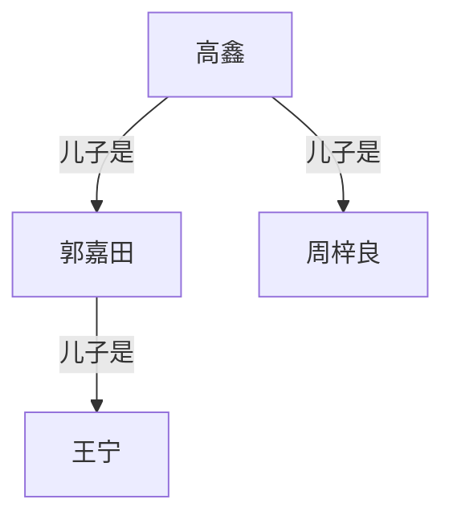

# <font face="仿宋" color=red>Markdown笔记</font>
## <center>LABI XIAOBA</center>
### 一.基本操作
1. **标题**
    - #(空格)一级标题
    - 一级标题
      ============
     二级标题
      ------------
1. **引用**  
   > 一级引用 
   >> 引用的嵌套
2. **列表** 
    1. 无序列表
    - 列表一
    * 列表二
    + 列表三
    2. Todolist
       - [ ] a
       - [x] b
    3. 列表混合嵌套只需要在子列表前留出2个或4个空格
    4. 列表中引用只需留出4个空格的缩进
3. **表格**
    |左对齐|居中对齐|右对齐|
    |:-----|:----:|-----:|
    |不需要考虑宽度,会自动调整|横杠数量不做要求|换<br>行|
4. **段落**
    1. 换行

        - 现代markdown中以不需要再结尾空两个以上空格后回车/空两行 直接回车即可
        - 若不想自动标号 shift+enter 软换行即可
        - 中间空一行表示一个新的段落

    2. 分割线 - 三个或多个以上* (行内不能有其他东西)
        ***
    3. 字体    
        |字体|代码|
        |:----:|:----:|
        |*斜体*|*  *|
        |==高亮==|==  ==|
        |**粗体**|**  **|
        |***斜粗体***|***  ***|
        |~~删除~~|~~  ~~|
        |<u>下划线</u>|`<u> </u>`|
        |&#x2705;|`&#x2705;`|
        |&#x274c;|`&#x274c;`|
        此处``为代码块表示需要,否则只写输入不显示`<u> </u>`
    4. 脚注
        在这里插入一段脚注[^1].
5. **代码**
    1. 单句代码 
        `printf("Hello World);`
        - 若要显示反引号,使用`` `printf("Hello World");` ``这样的格式
    2. 多行代码
        ```
        #include <iostream>
        using spacename std;
        int main(void)
        {
            printf("Hello World");
            return 0;
        }
        ```
    3. 特殊字符转义
        - 用双反引号包围单反引号 `` 要使用` `单引号``
        - 使用多个单引号包围 ``` 要使用``双引号```
        - 使用 `&nbsp;` 表示空格
        - `tab`键表示制表符
    4. 缩进式代码块
        - 前后空行,添加四个空格或一个制表符tab
        - 在列表中时需要八个空格
        - 代码块内必须保持一致的缩进
    5. 三引号式代码块支持高亮
        - cpp/c++ - C++
        - python/py - Python
            ```c++
            #include <iostream>
            using spacename std;
            int main(void)
            {
                printf("Hello World");
                return 0;
            }
            ```
    6. 行号显示
        - {.line-numbers}
            ```{.line-numbers}
            #include <iostream>
            using spacename std;
            int main(void)
            {
                printf("Hello World");
                return 0;
            }
            ```
    7. 代码差异对比
        - diff语法
        - 特定差异比较
             ```diff
            #include <iostream>
            using spacename std;
            int main(void)
            {
            +    printf("Hello World");
            -    return 0;
            }
            ```
6. **超链接**
    1. 方式一
        [更多使用教程可参考网站]: https://www.runoob.com/markdown/md-link.html
    2. 方式二  
        查看更多使用功能请[点击链接][教程]
    3. 方式三
        [runoob](https://www.runoob.com/markdown/md-link.html)
    4. 方式四
        <https://www.runoob.com/markdown/md-link.html>
7. **图片**
    - 使用图床保存图片并实现插入  
        [路过图床]: imgse.com/
    - 使用markdown语法插入,直接从图床复制markdown代码粘贴到这里即可
        [](https://imgchr.com/i/pVHMc9A)
    - 使用html语言实现调整图片大小和位置功能
8. **锚点链接**
    - 用于文档内的跳转,适合当长文档的导航
      - [一.基本操作](#一基本操作)
      - [二.其他操作](#二其他操作)
    - 锚点规则
        - 标题会自动生成锚点
        - 锚点名称通常为标题的小写模式
        - 空格替换为连字符
        - 移除特殊字符
    - 手动创建锚点
        - 自定义锚点位置 <a id="手动创建锚点"></a>
        - [跳转到自定义位置](#手动创建锚点)  


[^1]: 只有在插入解释后脚注才会正常显示;

[教程]: https://www.runoob.com/markdown/md-link.html

### 二.其他操作
- **插入latex公式**
    - 行内显示公式:
    $f(x)=ax+b$
    - 块内显示公式:
    $$
    \begin{pmatrix}
    a & b \\
    c & b 
    \end{pmatrix}
    $$
    - 更多更复杂的需要学习html语法
- **html语法与css语法**
    - `<font></font>`可设置字体.颜色.大小
    - `<center></center>`某行居中  
    - 使用css代码可使某标题居中
        1. ctrl shift p搜索 markdown preview enhanced customize css
        2. 在style中使用css语法改标题格式
    - 使用html语言实现调整图片大小与位置功能
        <a href="https://imgchr.com/i/pVHMc9A"><div align=center></div></a>
        <a href="https://imgchr.com/i/pVHMc9A"><div align=right></div></a>
- **个性化设置**

### 三.导出为pdf
- 右键代码区直接导出,但其使用html直接导出,并不美观
- 右键preview从浏览器打开,从浏览器另存为
### 四.Latex公式
1. 希腊字母
    - $\alpha$,$\beta$,$\gamma$
2. 求和 乘积 积分
   - $\sum$,$\prod$,$\int$
3. 分数
   - $\frac{1}{2}$
4. n次根
   - $\sqrt[n]{2x+1}$
5. 块级公式
   - $$E = mc^2$$
   - $$\int_{-\infty}^{\infty}e^{-x^2}dx=\sqrt{\pi}$$ 
6. 多行公式
   - $$
   \begin{align}
    f(x) &= ax^2 + bx + c \\
    f'(x)  &= 2ax + b \\
    f''(x)  &= 2a
   \end{align}
     $$
### 五.图表
1. 流程图
